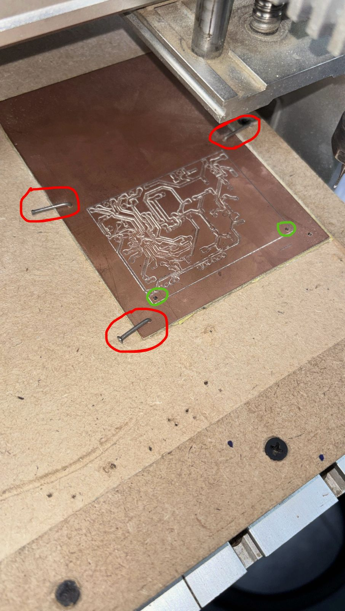
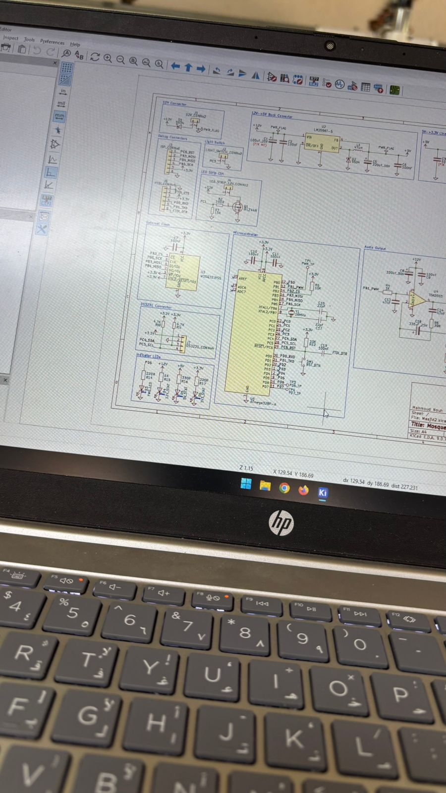
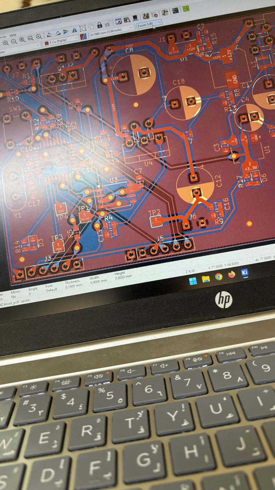
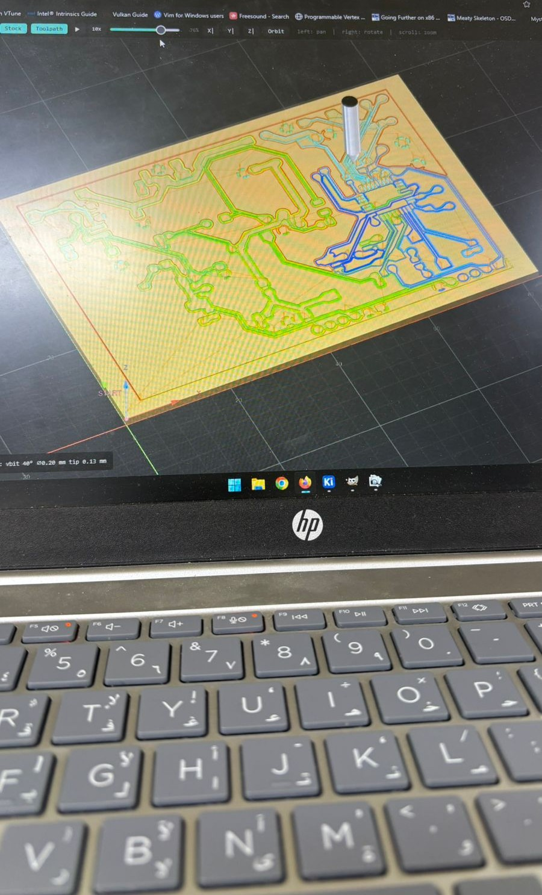
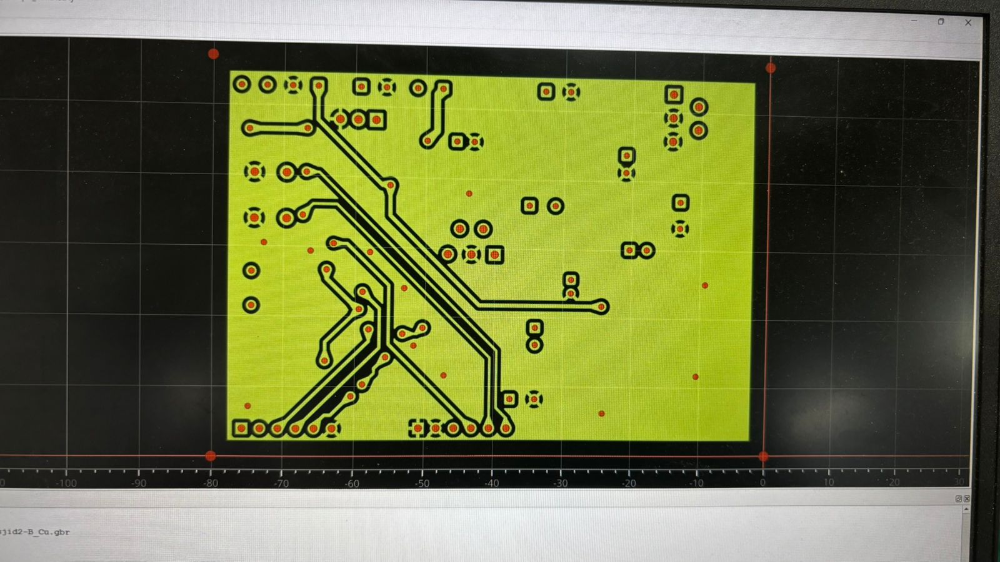

# Hardware of the Athan Lamp
This is the part that taught me the most, consumed the most time and energy, and which I enjoyed the most.

This is one of the first big electronics projects which I made.

## Planning the hardware
I began by planning the project and brainstorming it, I wanted a 12V LED strip inside the mosque so it can act as a lamp, and I wanted a loud speaker so it can be heard around the house, and I wanted an external flash chip to store high quality athan audios. In the end I made the following decisions because of some technical and financial limitations:
* Using a cheap ATmega328P MCU instead of an expensive wireless MCU like ESP32 or ESP8266. This would make it harder to get the athan times accurately because I cannot fetch them from online APIs, and I cannot get the local time accurately from online, but I solved this by using an RTC module for time tracking and implementing an offline athan time calculation code in C, which was not too difficult for me because of my background in C and programming in general. This decision saved me approximately 350 EGP (Egyptian Pounds): ATmega328P and DS3231 RTC module together cost approx. 250 EGP, ESP32 costs approx. 600 EGP.
* Using the SMD version of ATmega328P instead of THT. I only did this because it looked nicer and it saved space on the PCB to fit inside the mosque, but this decision caused me big problems during the fabrication stage which is explained later in the README.
* Using 3.3V instead of 5V to power the ATmega328P. Most reference designs online power the ATmega328P using 5V but this means that the chip will use 5V logic which is not supported by the flash IC I chose (W25Q), so I power it using 3.3V to make the logic level 3.3V to directly communicate with the flash IC without expensive level shifters.
* Designing two voltage regulation circuits. I wanted to use the LM2596 voltage regulator to step down 12V input from the wall adapter to 3.3V for the circuit but I could not find the 3.3V version of this chip locally in Egypt, but I found the 5V version of this chip and a cheap 3.3V linear converter called AMS1117, so I designed a circuit to step down from 12V to 5V using LM2596 then from 5V to 3.3V using AMS1117. I didn't regulate voltage from 12V to 3.3V directly using AMS1117 because AMS1117 is a linear regulator which dissipates power as heat and has low efficiency, so I thought it's a better idea to first use LM2596 which is a switching regulator to do most of the work then use AMS1117 to do the rest of the work to finally output 3.3V. I'm not sure if the heat dissipated by the AMS1117 with my input voltage and required current would have been a problem but I still wanted to do this two stage regulation circuit to gain experience.
* Using TDA2003 audio amplifier. I chose this amplifier because it can operate at 12V which I already have from the wall adapter. And because this amplifier is made for cars it can output a very high volume to the speakers.
* Using 16MHz crystal oscillator for the MCU. The ATmega328P spec does not officially support this clock speed at 3.3V but I found many people online who say it works even if it's not officially supported so I will take the risk.
* Using PWM + an RC filter instead of a DAC to output audio from the MCU to the amplifier. DACs are too expensive and I think the audio quality from PWM would be good enough, I don't know if this will make the audio quality bad but I will find out when I finish soldering the project and writing the firmware.
* Limiting the PCB to 2 layers only because I will fabricate the PCB by myself using a CNC machine.
* Using 0805 SMD size to make the PCB size smalle enough to fit inside the mosque.

## PCB Fabrication
This was the most difficult and time consuming part of the project and it had the most trial and error. I didn't want to outsource the PCB fabrication because
* I wanted to do as much as possible from the project by myself. And I already had some experience in PCB fabrication.
* I wanted to get more experience in PCB fabrication.
* I didn't want to spend time I spent a little bit more than a week trying to fabricate the PCB and I kept failing each time until it worked, and in the end I still had to use a bodge wire because one of the traces on the PCB was discontinuous because it's too thin.
You can see all the failed attempts below,

The PCB fabrication failed so many times because of these reasons,
* Traces are too thin relative to the CNC's drill bit. The drill bit I used for traces is a 30 degree 0.3mm V-bit so in the first prototypes I sometimes used trace widthes of 0.3mm exactly, but because of the CNC machine's runout these 0.3mm traces were eaten by the bit and were discontinuous. This was still sometimes a problem when I used 0.4mm traces so I learned that 0.5mm is the minimum trace width for stable results. 
* Annular rings are too small. This problem is the same as the last one but for annular rings in vias and through holes. In the beginning I used 0.35mm annular rings for vias and I still use them now but it's a little bit hard to solder them like this. So I learned that bigger annular rings than 0.35mm is better.
* PCB is too unstable on the CNC bed. In the first attempts I used double face tape to stabilize the PCB on the CNC bed. This was good for the traces stage and the drills stage. But in the outline stage when the CNC drill cuts the shape of the PCB from the copper board the PCB sometimes moves during the CNC job and it ruins the alignment forever because it is nearly impossible to put the PCB back in the exactly original location by hand. I fixed this by stabilizing the PCB using nails in addition to the double face (see red circles in fig. 1).
* PCB layers are not aligned when flipping the PCB to mill the back layer. This PCB is double layer so to mill the back layer I remove the PCB from the CNC bed and flip it then reapply double face tape on the other side to mill the back side of the PCB. This was a problem because it is impossible to put the PCB in the same exact place by hand after flipping it. This caused the front and back layers to be misaligned which broke the vias and through holes. I first tried to cut the PCB outline first then flip the PCB while keeping it inside the empty copper board around it. This method was still not accurate because the drill bit I used for outline was 1.5mm and it was impossible to bring back the PCB to the center of the copper board with a 1.5mm empty space at each edge. The solution that worked was to put 2 extra nails *inside* the PCB which act as references and stabilizers when flipping the PCB (see green circles in fig. 1), because if the nails are in the same place the PCB will also be in the same place. But if you try this solution yourself please remember to remove the nails inside the PCB cutout before milling the back layer because the CNC spindle could hit the nail which can damage the spindle or drill bit. This was going to happen with me but I was monitoring the CNC so I pressed the emergency stop button immediately.

Figure 1: PCB nails

Here are some photos and videos of the PCB design and fabrication stages, enjoy :)

https://github.com/user-attachments/assets/e8d4051a-8b4d-4367-8267-e0d7fdcb9eb9
https://github.com/user-attachments/assets/0141d8ae-49af-4be1-b656-2b18e7af8213

## Soldering
I am stuck on this part because I have exams soon so I don't have enough time to go to the makerspace and solder the board. But I will continue after the exams immediately. But the progress I have made is that I soldered the voltage regulation circuits and tested them with a multimeter. All three voltage rails show the correct voltages: 12V, 5V, 3.3V. And the 3 indicator lights for each power rail light up. I will update this part when continue the project after my exams.
https://github.com/user-attachments/assets/607396c5-5b5b-4540-83f0-784791250e4b
https://github.com/user-attachments/assets/899d02ef-4616-4838-a46c-5b3104206600
