# Athan Lamp Journal

I began this project because my new home was far away from the nearest mosque, too far away for me to hear the Athan (Islamic call to prayer). An easy fix to this would be to download an Athan application on my phone, but I'm better than that.

I decided to create a mosque model inside my house, that is not only a decoration, but a lamp, and most importantly, a source for the athan inside my home.

This is my first serious hardware and electronics project, and it took me several months of work, several prototypes, alot of trial and error, and frustrating bugs. But, I like challenges, and in the end I learned so many things, so it was 100% worth the struggle.

I learned electronic schematic and PCB design, double sided PCB fabrication using CNC machine, better soldering skills, circuit debugging, and how to use tools such as the oscilloscope and function generator.

## Planning Stage
I began by planning the project and brainstorming it, I wanted a 12V LED strip inside the mosque so it can act as a lamp, and I wanted a loud speaker so it can be heard around the house, and I wanted an external flash chip to store high quality athan audios. In the end I made some decisions because of some technical and financial limitations. These decisions were not final; some of them changed during the project's development, but these are the initial decisions I made before starting the project:
- 12V input to the PCB.
- Using the ATmega328P MCU as the brain of the PCB instead of an expensive wireless MCU like ESP32 or ESP8266. This would make it harder to get the athan times accurately because I cannot fetch them from online APIs, and I cannot get the local time accurately from online, but I solved this by using an RTC module for time tracking and implementing an offline athan time calculation code in C, which was not too difficult for me because of my background in C and programming in general, in addition to the abundance of offline athan calculation algorithms online which I used as references. This decision saved me approximately 350 EGP (Egyptian Pounds): ATmega328P and DS3231 RTC module together cost approx. 250 EGP, ESP32 costs approx. 600 EGP.
- Choosing the DS3231 RTC module. This module is especially good because it can survive power outages using a CR2032 battery.
- Using the SMD version of ATmega328P instead of THT. I only did this because it looked nicer and it saved space on the PCB to fit inside the mosque.
- Using 3.3V instead of 5V to power the ATmega328P. Most reference designs online power the ATmega328P using 5V but this means that the chip will use 5V logic which is not supported by the flash IC I chose (W25Q), so I power it using 3.3V to make the logic level 3.3V to directly communicate with the flash IC without expensive level shifters.
- Having a two stage voltage regulation circuit: first a switching regulator from 12V to 5V, then a linear regulator from 5V to 3.3V. The reason I made this decision was because I wanted to use the LM2596 regulator because it is very common and well-documented, but its 3.3V output version was not available locally in my country, but I found the 5V output version. So, I decided to first step down from 12V to 5V using LM2596T-5V, then from 5V to 3.3V using AMS1117-3.3V. I didn't want to use the AMS1117 directly from 12V to 3.3V because I read online that LDOs like the AMS1117 dissipate voltage as heat. To be honest, I didn't calculate if this would be a problem from 12V to 3.3V, which was a mistake from me, but it's not a big problem.
- Using TDA2003 audio amplifier. I chose this amplifier because it can operate at 12V which I already have from the wall adapter. And because this amplifier is made for cars it can output a very high volume to the speakers. And because it is cheap and available commonly in my country.
- Using 16MHz crystal oscillator for the MCU. The ATmega328P spec does not officially support this clock speed at 3.3V, so this is considered overclocking. However, I found many people online who say it works even if it's not officially supported, so I took the risk; because I want to compress the athan audios using ADPCM and I need a high clock speed to decompress and output PWM in real time. Of course, I had a backup plan in case this decision is wrong, which is to buy 8MHz and 12MHz crystals in case the 16MHz crystal didn't work. Because the maximum supported clock speed for the ATmega328P at 3.3V is around 12MHz.
- Using PWM + an RC filter instead of a DAC to output audio from the MCU to the amplifier. DACs are too expensive and I thought the audio quality from PWM would be good enough. I didn't know if this will make the audio quality too bad or not, but decided that I discover that when I finish soldering the project and writing the firmware.
- Limiting the PCB to 2 layers only because I wanted to fabricate the PCB by myself using a CNC machine where middle layers are not possible.
- Using 0805 SMD size to make the PCB size small enough to fit inside the mosque. Smaller sizes like 0603 or smaller are too hard to solder.
- Limiting the PCB's size to fit inside an enclosure.

## PCB Fabrication
This was the most difficult and time consuming part of the project, and it had the most trial and error. I didn't want to outsource the PCB fabrication because,
* I wanted to do as much as possible from the project by myself. And I already had some experience in PCB fabrication.
* I wanted to get more experience in PCB fabrication.

In the end, I had 3 PCB designs. The last one still had problems, but it worked.

## First PCB
This was my first PCB design ever, so it was very bad, very embarrasing, and I had to throw it away and make a new design.
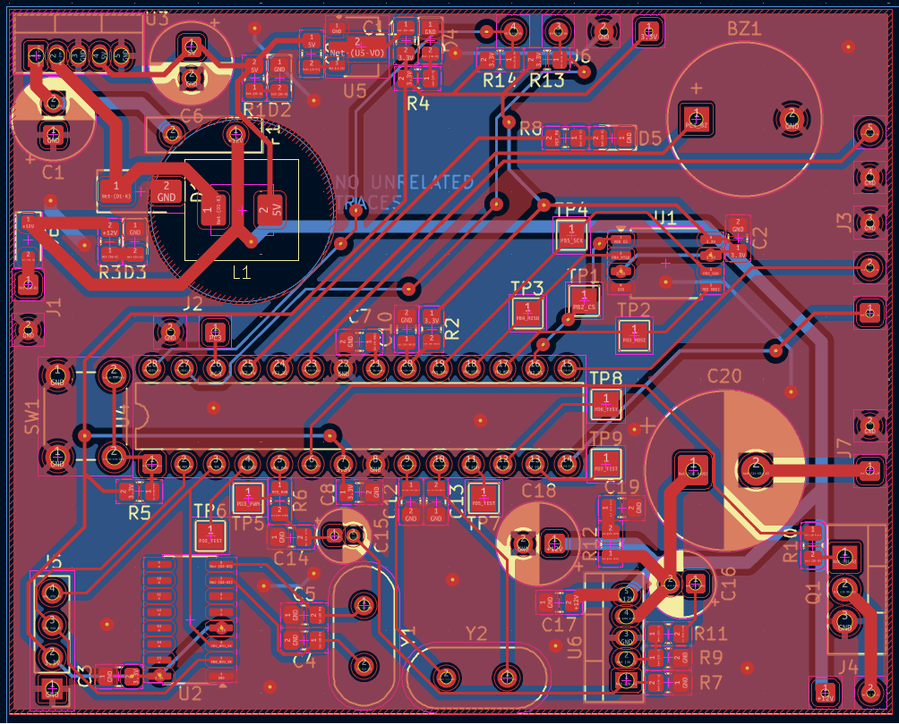
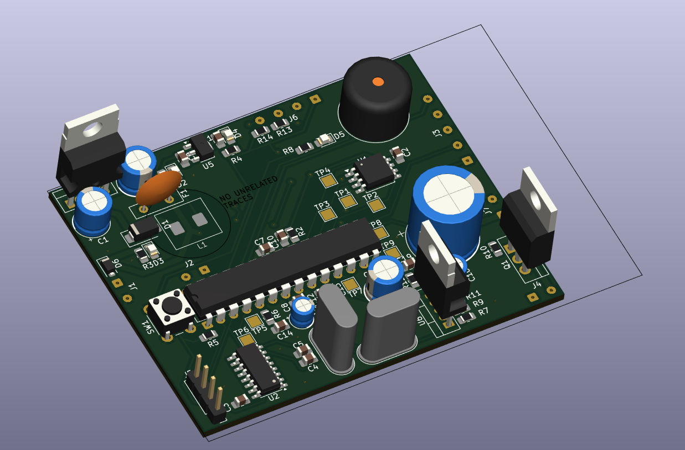

## Second PCB
This was my second attempt at designing the PCB, it was much better than the first one, because I learned from my mistakes and learned more about PCB design.
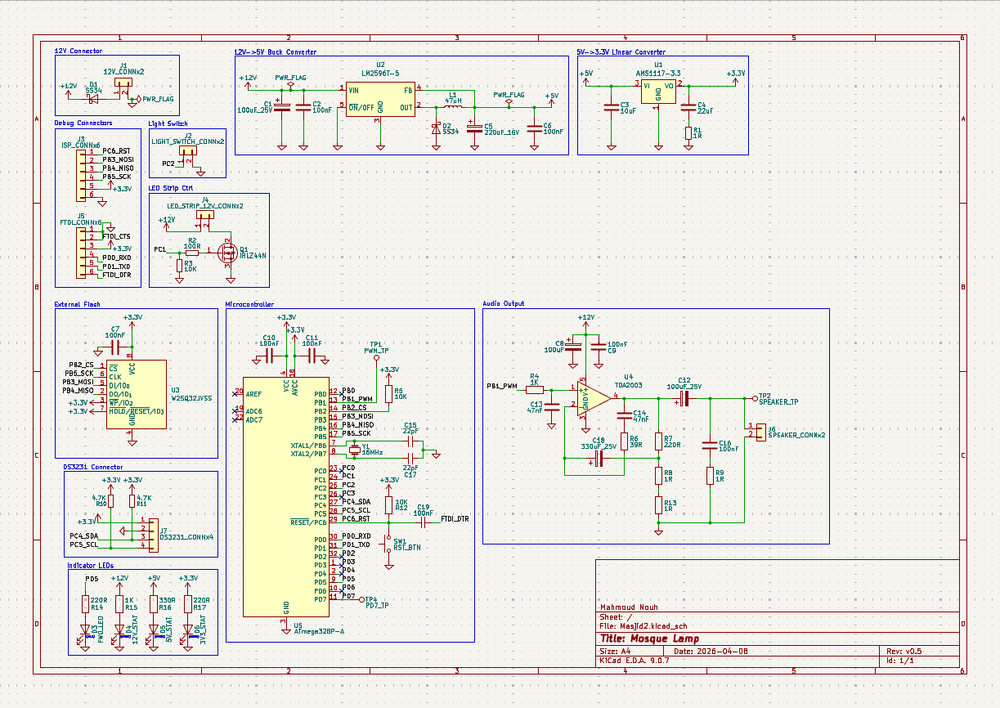
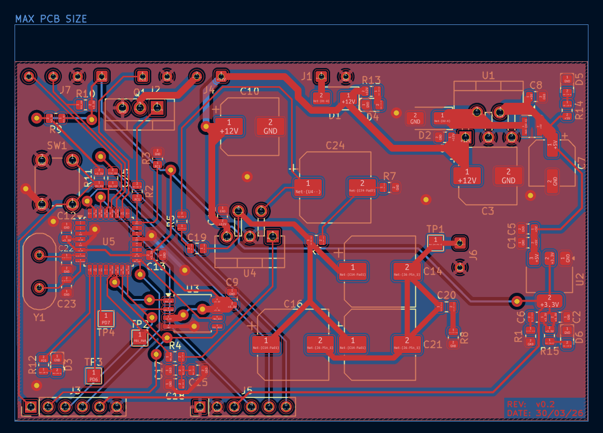

I spent a little bit more than a week trying to fabricate this version of the PCB and I kept failing each time until it worked, so far I had 4 failed attempts, and then a 5th attempt which I thought worked, but I'll talk about that in more detail later. In the end I still had to use a bodge wire because one of the traces on the PCB was discontinuous because it's too thin <sup>(see the photo below)</sup>, due to the CNC's Z-axis starting point being set too deep.

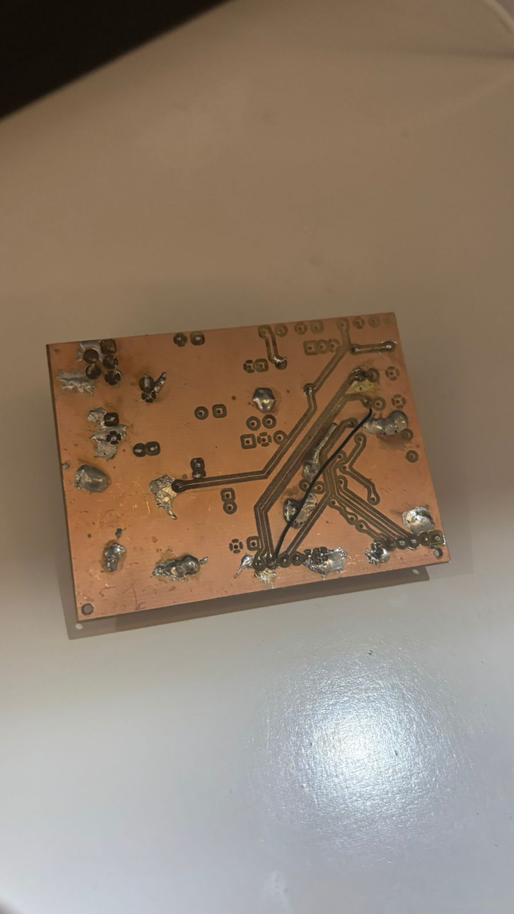

You can see all the failed PCB attempts below, each one took a whole day of work at the makerspace.


The PCB fabrication failed so many times because of these reasons,
* Traces are too thin relative to the CNC's drill bit. The drill bit I used for traces is a 30 degree 0.3mm V-bit, so in the first prototypes I sometimes used trace widthes of 0.3mm exactly and sometimes 0.2mm, but because of the CNC machine's runout these 0.3mm traces were eaten by the bit and were discontinuous. This was still sometimes a problem when I used 0.4mm traces so I learned that 0.5mm is the minimum trace width for stable results for my current configuration.
* Annular rings are too small. This problem is the same as the last one but for annular rings in vias and through holes. In the beginning I used 0.35mm annular rings for vias and I still use them now but it's a little bit hard to solder them like this. So I learned that bigger annular rings than 0.35mm is better.
* PCB is too unstable on the CNC bed. In the first attempts I used double face tape to stabilize the PCB on the CNC bed. This was good for the traces stage and the drills stage. But in the outline stage when the CNC drill cuts the shape of the PCB from the copper board the PCB sometimes moves during the CNC job and it ruins the alignment forever because it is nearly impossible to put the PCB back in the exactly original location by hand. I fixed this by stabilizing the PCB using nails in addition to the double face <sup>(see red circles in fig. 1)</sup>.
* PCB layers are not aligned when flipping the PCB to mill the back layer. This PCB is double layer, so to mill the back layer, I remove the PCB from the CNC bed and flip it, then reapply double face tape on the other side to mill the back side of the PCB. This was a problem because it is impossible to put the PCB in the exact same place by hand after flipping it; even an error of a quarter of a millimeter during placement would make the back layer misaligned. This mistake caused the front and back layers to be misaligned which broke the vias and through holes. I first tried to cut the PCB outline first then flip the PCB while keeping it inside the empty copper board around it. This method was still not accurate because the drill bit I used for outline was 1.5mm and it was impossible to bring back the PCB to the center of the copper board with a 1.5mm empty space at each edge. The solution that worked was to put 2 extra nails *inside* the PCB's outline, which act as references and stabilizers when flipping the PCB <sup>(see green circles in fig. 1)</sup>, because if the nails are in the same place then PCB will also be in the same place. But if you try this solution yourself please remember to remove the nails inside the PCB cutout before milling the back layer because the CNC spindle could hit the nail which can damage the spindle or drill bit. This was going to happen with me, but I was monitoring the CNC, so I pressed the emergency stop button immediately when I saw the spindle approaching the nail. **You should never leave the CNC machine running by itself, you must always monitor it to avoid damage.**
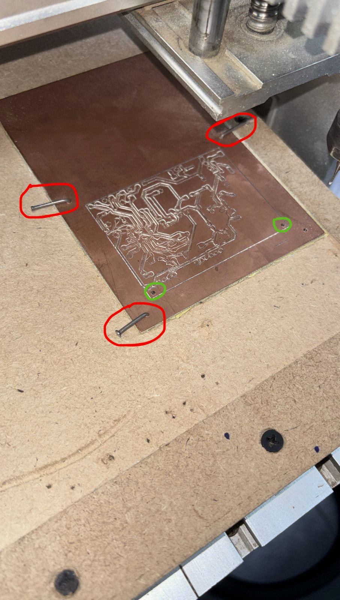
Figure 1: PCB nails

Here are some photos and videos of the second PCB's design and fabrication stages, enjoy. :)
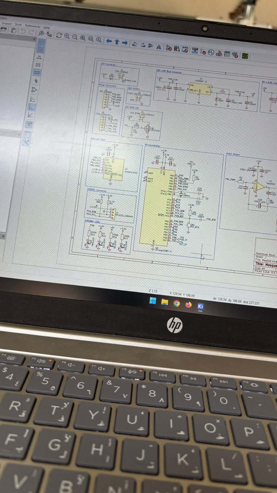
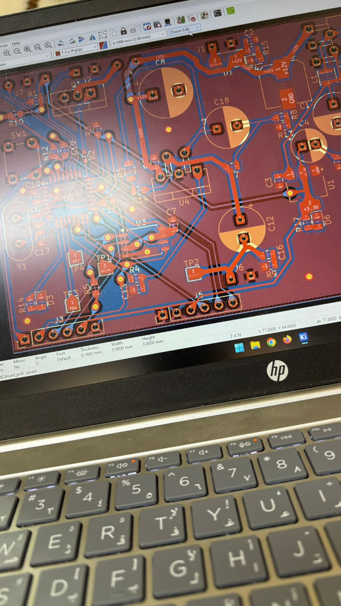
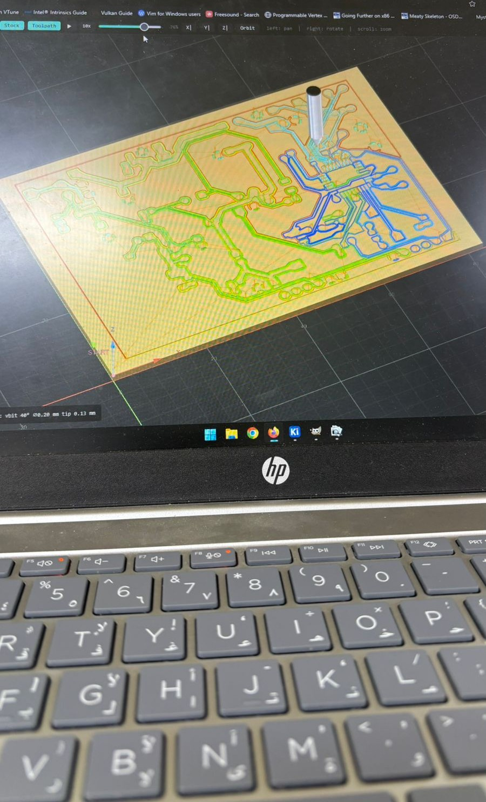
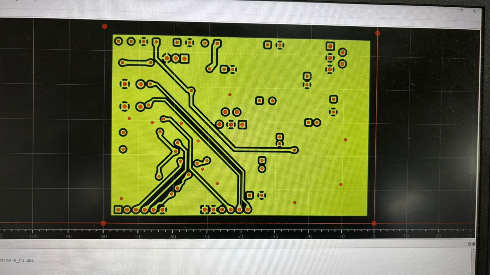
https://github.com/user-attachments/assets/e8d4051a-8b4d-4367-8267-e0d7fdcb9eb9
https://github.com/user-attachments/assets/0141d8ae-49af-4be1-b656-2b18e7af8213

### Assembling the second PCB
After the PCB was successfully fabricated, I started soldering it.

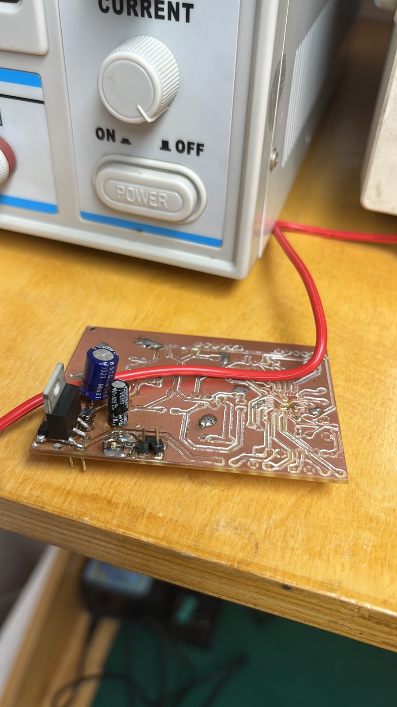

[Video of the process](https://www.youtube.com/watch?v=cgfooC_fla4)

Unfortunately, the second PCB did not work for two reasons: the ATmega328P SMD version was too small for the CNC machine I was using, and I had a via under the ATmega328P SMD which prevented it from being placed, because I don't know how to copper plate through holes or vias *yet*, so I have to fill vias by soldering a wire through them. The solder from the via raised the ATmega328P, and prevented it from being soldered, because it must lay perfectly flat on the PCB to be soldered. See the below image to understand,
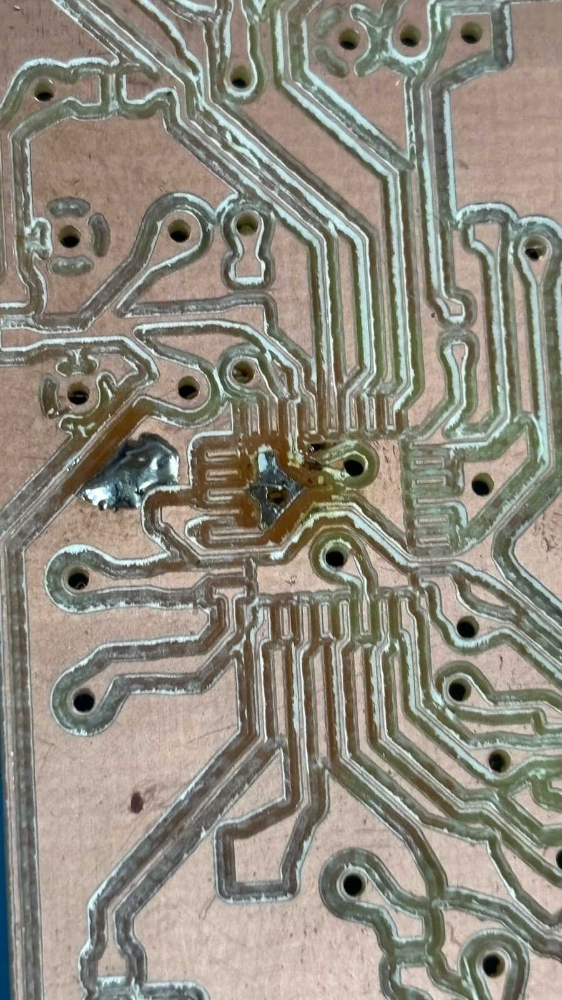

Additionally, I lifted the trace for this via, maybe because of the soldering iron's temperature was too high. This trace being lifted made it completely unsolderable. This was worse because of the annular ring which was too small, and traces which were too thin.

## Third PCB
Because of the problems of the last PCB, especially the ATmega328P SMD problem, I decided to leave the PCB, and I was very sad because of this. Then, I decided to redesign the PCB and have it manufactured by a local PCB fab house instead of fabricating it by myself.

This redesign had one major change, which is to use the THT version of the ATmega328P instead of the SMD version. In addition to other small changes to make the PCB manufacturable by this new fab house. Additionally, this PCB was generally better than the last two PCBs because I had more experience in PCB design, so I was able to make a better PCB. This redesign also had more vias because the fab house would solder them for me.

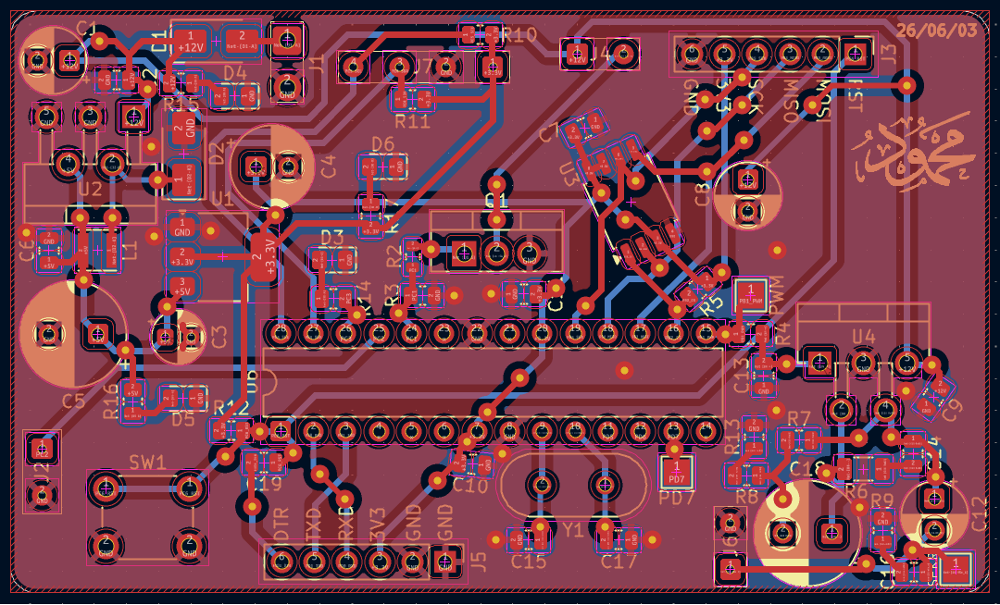
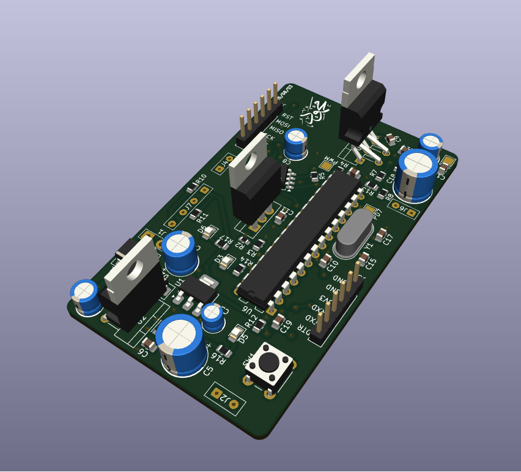

After the PCB arrived, I found that it still had some mistakes, but these mistakes were not big enough to require a redesign. The biggest mistake was that I still placed vias under components which lay flat on the PCB (e.g. SMD components, electrolytic capacitors if not raised). I solved this by trimming the meniscuses of the soldered vias and carefully soldering the components so they are raised very slightly.

## PCB Assembly and Debugging
Finally, the third PCB arrived from the fab house, and I was very happy by the result. So, after desoldering the components from the last PCB, I started soldering the new PCB immediately.

First, I soldered the power regulation circuit, [then connected the PCB to 12V power supply, and I saw three green lights (12V, 5V, 3.3V) from the first try](https://youtube.com/shorts/RPINZ2h2Tds) :)

Then, I soldered the MCU circuit and tried to program it using the Arduino IDE with a FTDI module.

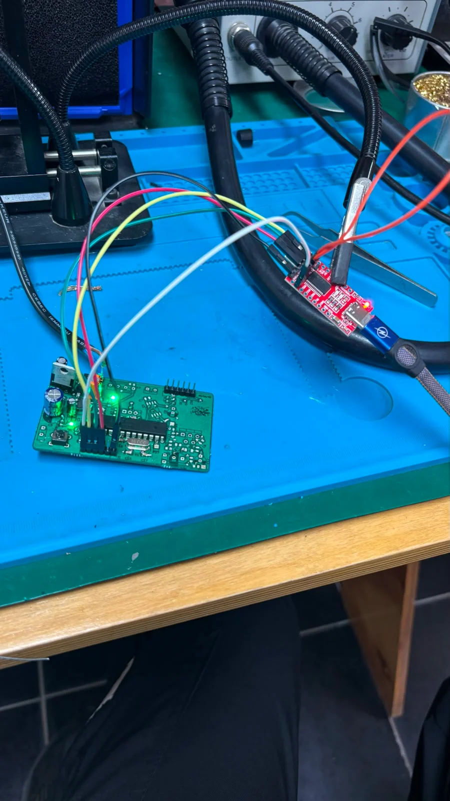

Unfortunately this failed, I didn't know why, the Arduino IDE kept saying that the board is not responding. I kept debugging this problem for a long time and didn't reach any conclusion, so I went back home.

The next day, I woke up early and brought out a multimeter, a Raspberry Pi, jumper cables, and my PCB.

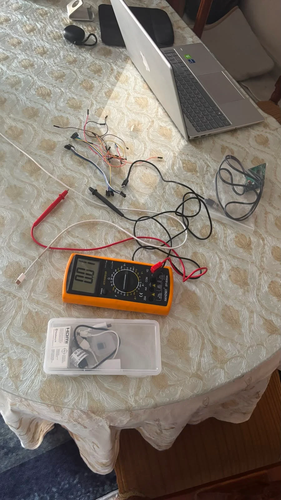

I first checked the board for shorts using the multimeter, and found no shorts. Then, I installed AVRDUDE on my Raspberry Pi. Then, I connected the Raspberry Pi's SPI pins to the Athan Lamp's ISP pins so I can try to flash a program to it from the Pi using AVRDUDE over ISP instead of ArduinoIDE over FTDI. However, when I tried to do this, AVRDUDE kept saying that the speed is too fast for the board. I tried making the speed as low as possible, very unrealistically low, and it still kept saying that the communication speed is too fast for the board. This made me suspect that the crystal is not oscillating at the right speed, or maybe not oscillating at all. So I started to learn how to use an oscilloscope so that next time I go to the makerspace I can use it to check the crystal.

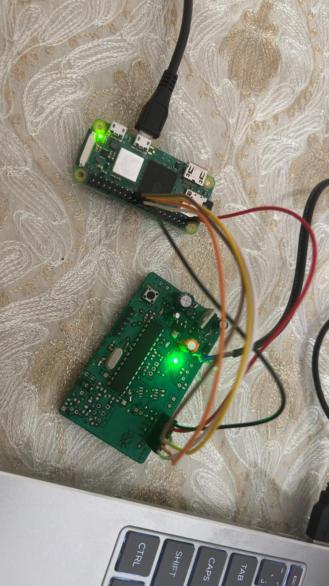

After learning how to use an oscilloscope, I went to the makerspace to continue debugging the board. I started to probe the MCU XTAL pins and the pins of the crystal itself. Unfortunately, the oscilloscope showed a flat line on all of those pins, but I still wasn't 100% sure if that was because the crystal is not oscillating, or because I was using the oscilloscope wrong.

So I asked someone at the makerspace for help, because he knows more about electronics than me, and knows how to use the oscilloscope. The oscilloscope was still showing a flat line even after this person used the oscilloscope correctly.

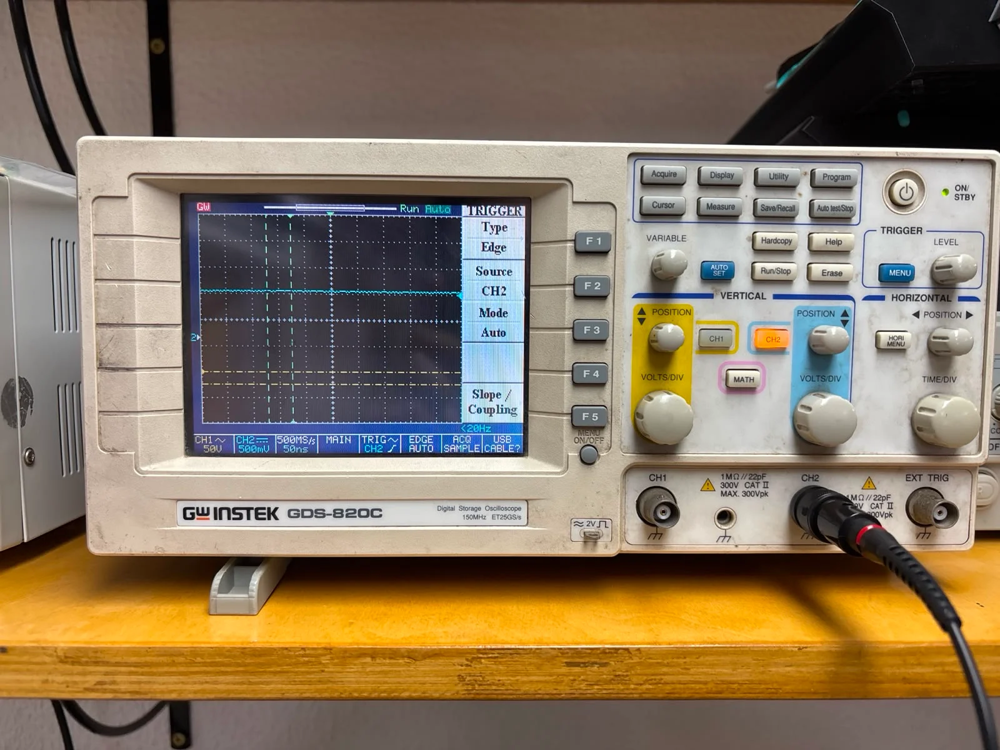

After that, I was very confused, because I thought I did everything correctly. I kept reviewing the schematic to check if the oscillator circuit was wrong, but it wasn't wrong. I kept debugging this for hours, and all of thet signs and the information I saw online were saying that the problem was in the crystal. So I guessed that the crystal was broken and tried replacing the 16MHz crystal with the 8MHz crystal I bought as a backup, and the crystal still failed to oscillate. After that, I tried testing the 16MHz crystal with a function generator by following a tutorial on YouTube, but I wasn't able to test the crystal. Then, I thought of using the function generator to inject the 16MHz sine wave I wanted into the XTAL pins directly, so I can check if the problem was in the MCU or not. But unforunately, the function generator I was using had a maximum output frequency of 5MHz, which was not enough for the MCU. Then I finally had a thought: because SMD ceramic capacitors don't have their values written on them, maybe I accidentally used wrong load capacitors for the crystal oscillator. The oscillator needs two 22pF capacitors, so maybe I used 100nF by accident, and because that value is so large, it smooths the crystal output completely, making it appear flat on the oscilloscope.

After having that thought, I checked my bag and boxes of components for the 22pF capacitors I bought, and I found them still in their reel. I also found that there were two 100nF capacitors missing. That means that I accidentally used 100nF instead of 22pF for the crystal circuit. This is a very stupid mistake.

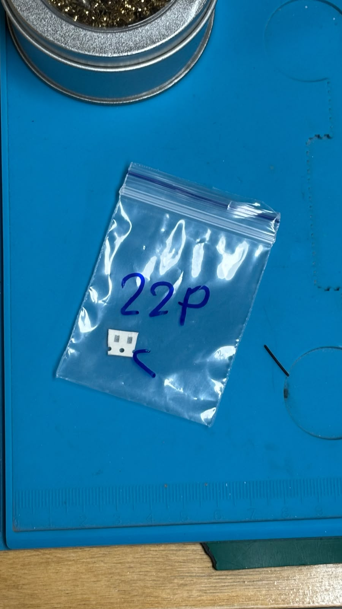

This also explains why the oscilloscope's output wasn't completely flat, there was a very very low amplitude wave, shown in the image below. My theory is that having the load capacitors that high made the crystal oscillate but with a much lower amplitude wave, the wave's amplitude was so low that the oscilloscope couldn't display it other than moving it by one pixel up or down. This 100% makes sense because the ratio between 22pF and 100nF is 4,545! To calculate the amplitude of the wave with 100nF load capacitors, we will take the amplitude of the wave with 22pF capacitors, which is approximately 600mV, and scale that by the ratio between 22pF and 100nF, which is 4,545. This means that the amplitude of the XTAL wave with 100nF load capacitors is approximately 0.132mV! Too low for the oscilloscope to display correctly. In conclusion, the XTAL pins were oscillating, but in a very low amplitude, because its load capacitors were too high.

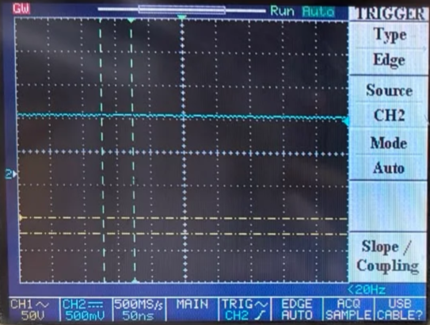

I was very annoyed and confused that SMD capacitors don't write the values like resistors, so I made [this post](https://www.reddit.com/r/AskElectronics/comments/1u87ta3/why_dont_smd_capacitors_have_their_values_written/) to ask why.

Then, after I replaced the load capacitors with the correct values, the board started oscillating, and [I was able to upload code to it](https://user-cdn.hackclub-assets.com/019f119b-c574-7376-b2e4-844422d3d909/WhatsApp%20Video%202026-06-29%20at%207.09.42%20AM.mp4).
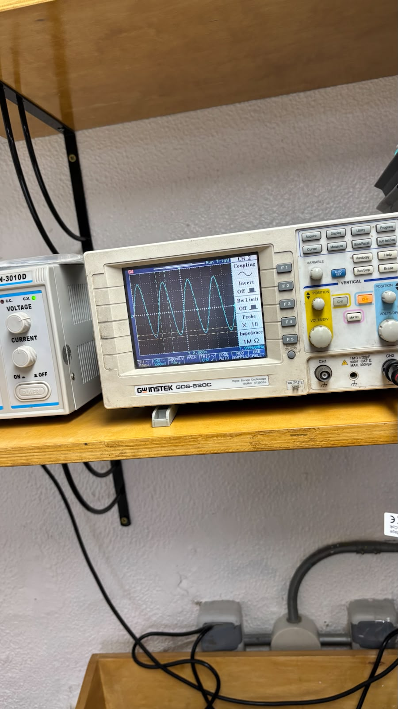

After that, when I was able to upload code to the MCU using Arduino IDE, I soldered the RTC module and [the LED strip](https://user-cdn.hackclub-assets.com/019f11a8-25c0-7a10-b648-b393d44cafa7/WhatsApp%20Video%202026-06-29%20at%207.22.54%20AM.mp4). I spent some time debugging the RTC module because it didn't light up in the beginning, but it was a small mistake of grounds not being connected.

Then, I soldered the TDA2003 amplifier circuit but it didn't work, I don't know why. The TDA2003 IC got very very hot and didn't output any audio. And before that, the power regulation circuit of the PCB made some smoke, right after I soldered the TDA2003 circuit. I don't know why that happened, and the board worked correctly without making any changes, so it's not a big problem. I decided that TDA2003 was too loud anyways, so I soldered a PAM8403 module to the PCB and speaker. After testing it and uploading a sketch to output a beep sound, [it worked](https://cdn.hackclub.com/019f11af-83cb-7737-bf6b-d44dea1c3d86/WhatsApp%20Video%202026-06-29%20at%207.28.33%20AM.mp4).

After the speaker was working, I started to port the prototype code which I wrote from C for Windows to C++ for Arduino IDE.

Unfortunately this wasn't very straight forward. Eventually, the code compiled, but the athan times were completely wrong; some of them were calculated as "negative" time, I remember seeing "-1:-41AM", which is clearly not correct.

I spent some time trying to debug this, and I really didn't understand what was happening, until I finally noticed these lines,
```cpp
typedef int I32;
typedef unsigned int U32;
```
Usually in my code, I like to define these sized values because I find them easier and cleaner. They worked correctly on Windows, but on the ATmega they were completely wrong. This is because an `int` in Windows is 32 bits, but in ATmega it's 16 bits, so when I was trying to use 32 bit integers, I was actually using 16 bits. This caused some integer overflow bugs which were the reason why I got negative athan times; values would be added to these small integers, but because their maximum is around 30 or 60 thousand (depending on signed or unsigned), they would sometimes overflow over that maximum value, and wrap back to a negative value. I fixed this by redefining these types to be exactly 32 bits on ATmega.
```cpp
typedef int32_t I32;
typedef uint32_t U32;
```

After making that fix, the ATmega finally was calculating the athan times accurately, just like the prototype I wrote for Windows.

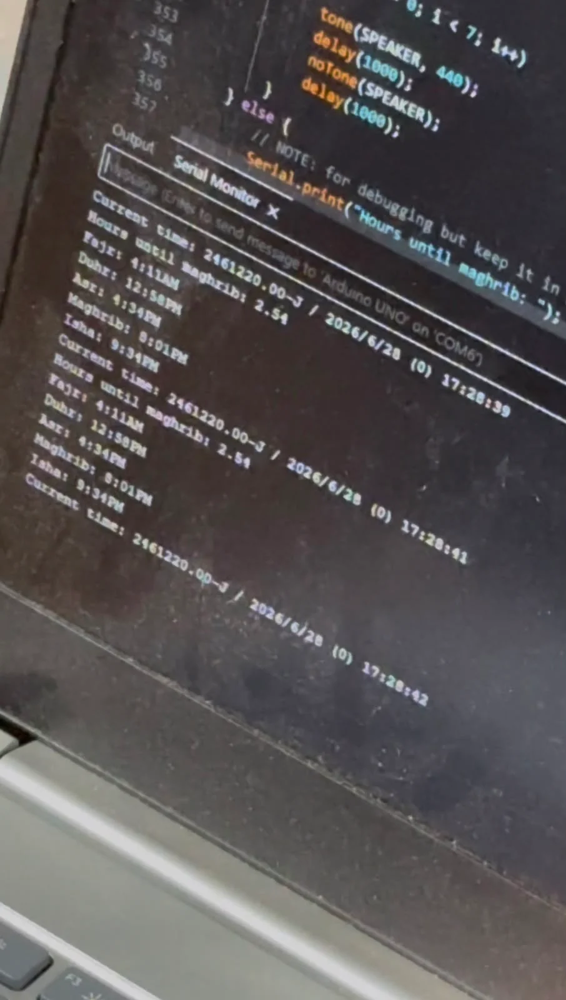

After that, I kept the athan lamp powered on and waited until the next athan time to see if it would make an alarm sound as expected. During this waiting time, the power cut off from the makerspace several times, including the power supply which the athan lamp was connected to. These power outages are usually bad, but at this time it was very good because it proved to me that the athan lamp can keep track of time even during power outages, which was an intended feature.

Thankfully, the power came back before the athan time, so I brought a friend to record the athan lamp with me during the athan time to see if it will make an alarm or not, and finally, after approximately 2 months of work or more, and many failed attempts, the [alarm worked](https://youtu.be/aE38t-XnRy0)!!!! 🥳🥳🥳
